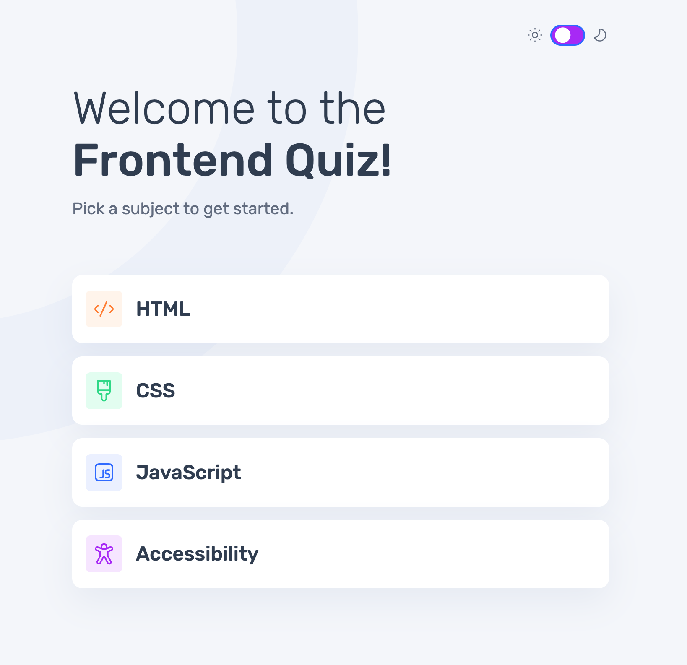
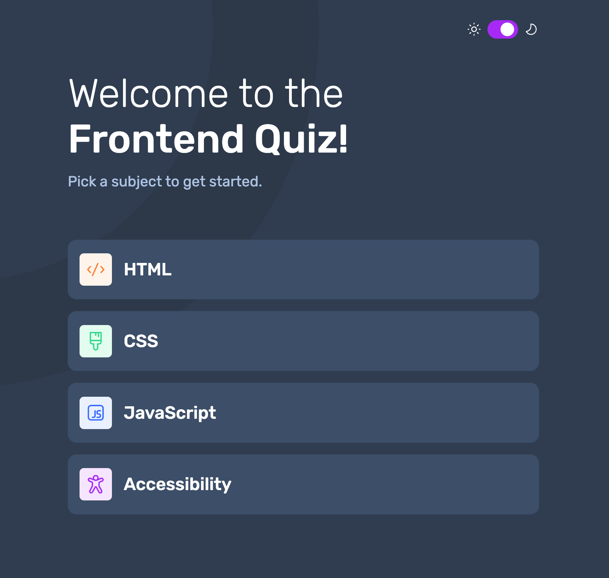

# Frontend Mentor - Frontend quiz app solution

This is a solution to the [Frontend quiz app challenge on Frontend Mentor](https://www.frontendmentor.io/challenges/frontend-quiz-app-BE7xkzXQnU). Frontend Mentor challenges help you improve your coding skills by building realistic projects.

## Table of contents

- [Frontend Mentor - Frontend quiz app solution](#frontend-mentor---frontend-quiz-app-solution)
  - [Table of contents](#table-of-contents)
  - [Overview](#overview)
    - [The challenge](#the-challenge)
    - [Screenshot](#screenshot)
      - [Light Mode](#light-mode)
      - [Dark Mode](#dark-mode)
    - [Links](#links)
  - [My process](#my-process)
    - [Built with](#built-with)
    - [What I learned](#what-i-learned)
    - [Continued development](#continued-development)
    - [Useful resources](#useful-resources)
  - [Author](#author)

## Overview

### The challenge

Users should be able to:

-   Select a quiz subject
-   Select a single answer from each question from a choice of four
-   See an error message when trying to submit an answer without making a selection
-   See if they have made a correct or incorrect choice when they submit an answer
-   Move on to the next question after seeing the question result
-   See a completed state with the score after the final question
-   Play again to choose another subject
-   View the optimal layout for the interface depending on their device's screen size
-   See hover and focus states for all interactive elements on the page
-   Navigate the entire app only using their keyboard
-   **Bonus**: Change the app's theme between light and dark

### Screenshot

#### Light Mode

#### Dark Mode

### Links

-   Solution URL: [https://github.com/EmLopezDev/Frontend-Quiz](https://github.com/EmLopezDev/Frontend-Quiz)
-   Live Site URL: [https://emlopezdev.github.io/Frontend-Quiz/](https://emlopezdev.github.io/Frontend-Quiz/)

## My process

### Built with

-   Semantic HTML5 markup
-   SCSS custom properties, functions, and mixins
-   Flexbox
-   Mobile-first workflow
-   Vanilla JavaScript

### What I learned

-   How to set up a modular JavaScript project.
-   Handling lots of DOM manipulation
-   The importance of writing simple well organized code specifically JavaScript. While writing the JS for this challenge I noticed the code was getting all over the place which then made it challenging top clean up at the end. My own fault but I learned the more organized you are from the beginning the better it will be for you down the line.
-   How to set up a light/dark theme and how to save it to local storage.
-   How to create a toggle switch.

### Continued development

-   I want to continue creating more complexed apps with more complexed logic, I am definitely getting better at it but would like to keep sharpening these skills.
-   Writing more effecient code from the beginning. I want to be able to better identify what can be abstracted or turned into resuable bits earlier on.
-   I want to start incoporating test into these projects so I can make sure they work well and not have to ask multiple people to test it out for me.

### Useful resources

-   [Light/Dark Theme](https://www.youtube.com/watch?app=desktop&v=_gKEUYarehE&t=21s) - How to set up a light and dark theme on your app.
-   [Toggle Switch](https://www.youtube.com/watch?v=VHDoTL8OEns) - How to create a toggle switch.

## Author

-   Frontend Mentor - [@EmLopezDev](https://www.frontendmentor.io/profile/EmLopezDev)
